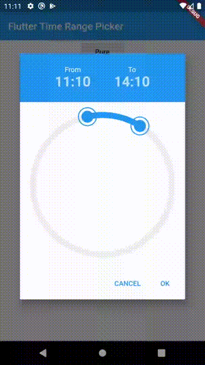
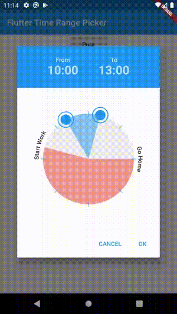
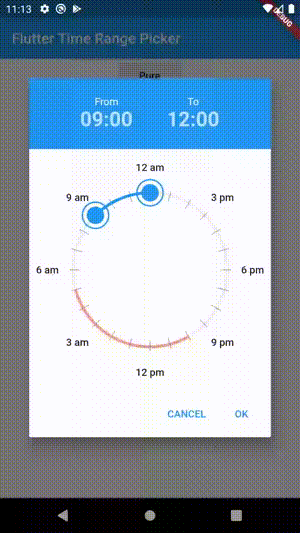
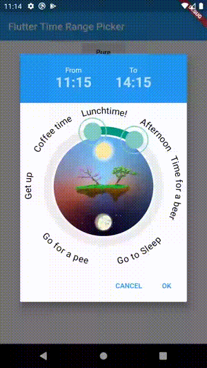

# Time Range Picker

A time range picker for flutter.

## Getting Started

- [Time Range Picker](#time-range-picker)
  - [Getting Started](#getting-started)
    - [Installation](#installation)
    - [Basic Usage](#basic-usage)
    - [Examples](#examples)
      - [Simple](#simple)
      - [Interval](#interval)
      - [Filled Style](#filled-style)
      - [Disabled Timeframe](#disabled-timeframe)
      - [Background Widget](#background-widget)
      - [Rotated Clock](#rotated-clock)
      - [Max Duration](#max-duration)
      - [Min Duration](#min-duration)
      - [Default Widget](#default-widget)
      - [Custom Dialog](#custom-dialog)
      - [Custom Dialog iOS Style](#custom-dialog-ios-style)
    - [Parameters](#parameters)


### Installation

Add

```bash

time_range_picker : any

```

to your pubspec.yaml, and run

```bash
flutter packages get
```

in your project's root directory.

### Basic Usage


```dart
import 'package:flutter/material.dart';

import 'package:time_range_picker/time_range_picker.dart';

void main() => runApp(MyApp());

class MyApp extends StatelessWidget {
  @override
  Widget build(BuildContext context) {
    return MaterialApp(
      theme: ThemeData(
        primarySwatch: Colors.blue,
      ),
      home: MyHomePage(),
    );
  }
}

class MyHomePage extends StatelessWidget {
  @override
  Widget build(BuildContext context) {
    return Scaffold(
        backgroundColor: Colors.blueGrey,
        body: Center(
          child: RaisedButton(
            onPressed: () async {
              TimeRange result = await showTimeRangePicker(
                context: context,
              );
              print("result " + result.toString());
            },
            child: Text("Pure"),
          ),
        ));
  }
}
```

### Examples

#### Simple


#### Interval


#### Filled Style


#### Disabled Timeframe


#### Background Widget


#### Rotated Clock


#### Max Duration


#### Min Duration


#### Default Widget


#### Custom Dialog


#### Custom Dialog iOS Style


### Parameters

| type                | param               | default                     | description                                                                     |     |
| ------------------- | ------------------- | --------------------------- | ------------------------------------------------------------------------------- | --- |
| TimeOfDay           | start               | TimeOfDay.now()             | preselected start time                                                          |     |
| TimeOfDay           | end                 | now + 3h                    | preselected end time                                                            |     |
| TimeRange           | disabledTime        |                             | disabled time range (this time cannot be selected)                              |     |
| Color               | disabledColor       | Colors.red.withOpacity(0.5) | the color for the disabled section                                              |     |
| PaintingStyle       | paintingStyle       | PaintingStyle.stroke        | Style of the arc (filled or stroke)                                             |     |
| Function(TimeOfDay) | onStartChange       |                             |                                                                                 |     |
| Function(TimeOfDay) | onEndChange         |                             |                                                                                 |     |
| Duration            | interval            | Duration(minutes: 5)        | Minimum time steps that can be selected                                         |     |
| String              | fromText            | "From"                      | label for start time                                                            |     |
| String              | toText              | "To"                        | label for end time                                                              |     |
| bool                | use24HourFormat     | true                        | use 24 hours or am / pm                                                         |     |
| double              | padding             | 36                          | the padding of the ring                                                         |     |
| double              | strokeWidth         | 12                          | the thickness of the ring                                                       |     |
| Color               | strokeColor         | primaryColor                | the color of the active arc from start time to end time                         |     |
| double              | handlerRadius       | 12                          | the radius of the handler to drag the arc                                       |     |
| Color               | handlerColor        | primaryColor                | the color of a handler                                                          |
| Color               | selectedColor       | primaryColorLight           | the color of a selected handler                                                 |     |
| Color               | backgroundColor     | Colors.grey[200]            | the color of the circle outline                                                 |     |
| Widget              | backgroundWidget    |                             | a widget displayed in the background, use e.g. an image                         |     |
| int                 | ticks               |                             | number of ticks displayed                                                       |     |
| double              | ticksOffset         | 0                           | the offset for ticks                                                            |     |
| double              | ticksLength         | strokeWidth                 | ticks length                                                                    |     |
| double              | ticksWidth          | 1                           | ticks thickness                                                                 |     |
| Color               | ticksColor          | Colors.white                | Color of ticks                                                                  |     |
| bool                | snap                | false                       | Snap time bar to interval                                                       |     |
| List<ClockLabel>    | labels              |                             | Show labels around the circle (start at 0 hours)                                |     |
| double              | labelOffset         | 20                          | Offset of the labels                                                            |     |
| bool                | rotateLabels        | true                        | rotate labels                                                                   |     |
| bool                | autoAdjustLabels    | true                        | flip labels if the angle woulb be upside down (only if rotate labels is active) |     |
| TextStyle           | labelStyle          |                             | Style of the labels                                                             |     |
| TextStyle           | timeTextStyle       |                             | TextStyle of the time texts                                                     |     |
| TextStyle           | activeTimeTextStyle |                             | TextStyle of the currently moving time text                                     |     |
| bool                | hideTimes           | false                       | hide the time texts                                                             |     |
| double              | clockRotation       | 0                           | rotate the clock around angle                                                   |
| Duration            | maxDuration         | null                        | maximum Duration that can be picked                                             |     |
| Duration            | minDuration         | Duration(minutes: 30)       | minimum Duration that can be picked                                             |     |
| bool                | barrierDismissible  | true                        | barrierDismissible false = user must tap button to close time range picker      |     |


